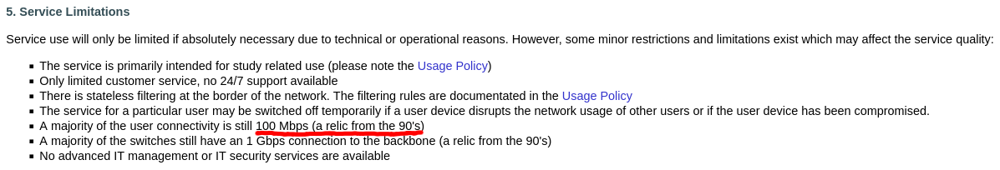

# unsorted

## random notes

- Onko ollut kilpailutuksena Hilmassa?
  - ei ole ollut, olisi pitänyt

- [AYY on velvoitettu toteuttamaan julkinen kilpailutus hyvän hallinnon mukaisesti](https://www.suomi.fi/yritykselle/liiketoiminnan-kehittaminen/markkinointi-ja-myynti/opas/myynti/julkiset-hankinnat)

- asumiseen liittyvät palvelut kuuluu yhteishallintolain piiriin ja niihin on annettava asukkaille mahdollisuus lausua ennen päätöksiä ja osallistua asian käsittelyyn

- kyseenalaista vetää YT:t ennen tarjouskilpailua

- kokouksen esityslistassa osana toimiston kuulumisia, ei edes päätösasia

- edarille kerrottiin edustajistokauden viimeisessä kokouksessa. Tämän jälkeen edustajisto vaihtui.

- *"Jos yhteisöllä on palkattuna omaa henkilöstöä tarvittavia palveluja varten, sen ei tarvitse kilpailuttaa tällaisia palveluja. On kuitenkin aika ajoin perusteltua selvittää, että itse järjestetyn palvelun hinta on ulkopuoliselta toimijalta saatavaa palvelua edullisempi."*

- tupsu, eduroam, muiden palveluiden kulut

- [Laki yhteishallinnosta valtion tukemissa vuokrataloissa](https://www.finlex.fi/fi/lainsaadanto/saadoskokoelma/2022/1169#OT7), vaatii että asukkaiden ja vuokrataloyhteisön väliselle yhteistyöelimelle pitää tiedottaa tulevista kilpailutuksista ja varata mahdollisuus esittää huomionsa.

- DNA:lta ei saa 1/1 gbps liittymää edes rahalla
  - 1000/500 30€/kk

- Fun fact: 100M yhteys oli Trinetin mukaan "reliikki 90-luvulta" [jo 15 vuotta sitten](https://web.archive.org/web/20110711032928/http://verkko.ayy.fi/description/).

## domo

Ensimmäinen kuva tallennettu domon vuokrasopimuksen yhteydestä, sivulta joka otsikoitu "Sopimuksen asunnon tiedot" 19.1.

Sen jälkeen 1/1Gbps nopeus on kätevästi poistunut sopimuksen asunnon tiedoista

